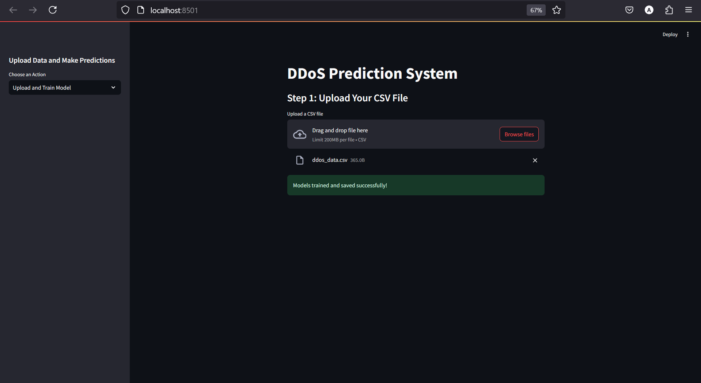
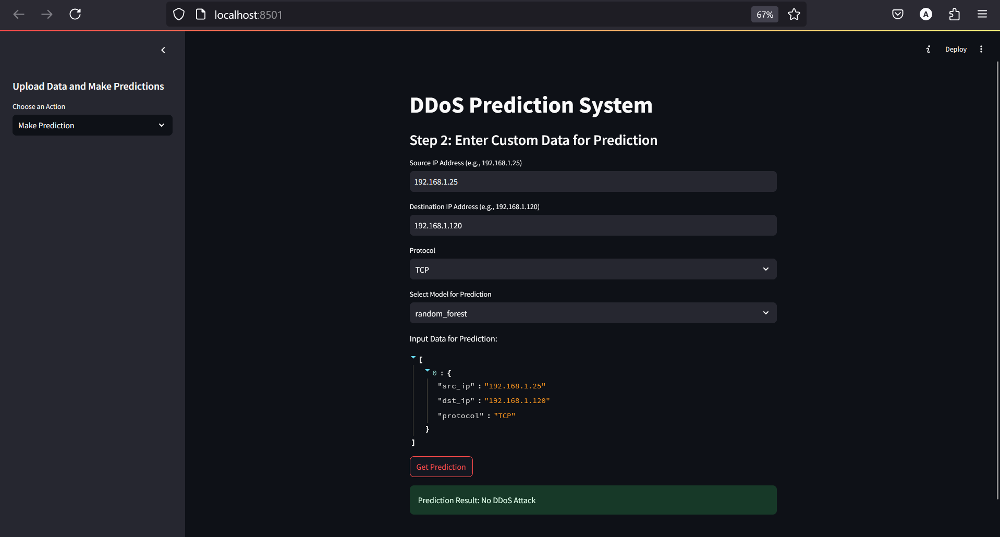

# DDoS Prediction System for 5G Networks 🌐

## 🚀 Overview  
Distributed Denial of Service (DDoS) attacks are among the most severe threats to the stability of modern communication networks, especially with the advent of **5G**. This project presents an **ML-based DDoS prediction system** that leverages real-time anomaly detection to secure 5G networks. The system offers **high accuracy, minimal latency**, and a **user-friendly dashboard**, making it an effective tool for network administrators.

---

## ✨ Features  
- **Real-Time Traffic Analysis**: Detect DDoS attacks with minimal latency.  
- **Machine Learning Models**: Employ advanced algorithms like **Random Forest**, **KNN**, and **Naive Bayes**.  
- **Interactive Dashboard**: Visualize network activity and anomalies with ease.  
- **Scalable Design**: Tailored to handle the high volume and complexity of 5G traffic.

---

## 🛠 System Architecture  
### Components  
1. **Data Collection & Preprocessing**
   - Dataset should look like the one whicj is present in the sample dataset folder.
   - Collects and cleans network traffic data.  
   - Extracts key features: Source IP, Destination IP, Protocol, and DDoS Label.

3. **Machine Learning Module**  
   - Implements predictive models for real-time anomaly detection.

4. **Visualization & Mitigation Module**  
   - Interactive dashboard for monitoring and mitigating threats.

### Workflow  
1. **Data Ingestion**: Traffic collected from 5G nodes.  
2. **Preprocessing**: Cleaning, normalization, and feature extraction.  
3. **Prediction**: ML models identify anomalies.  
4. **Visualization**: Insights displayed via an interactive dashboard.

---

## 📊 Results  
### Model Performance  
The system achieves exceptional results, as summarized below:

| Model          | Accuracy | Precision | Recall | F1-Score |
|----------------|----------|-----------|--------|----------|
| **Random Forest** | 97.5%    | 96.8%     | 98.3%  | 97.5%    |
| **KNN**          | 94.2%    | 93.1%     | 95.6%  | 94.3%    |
| **Naive Bayes**   | 89.7%    | 87.5%     | 91.2%  | 89.3%    |

### Experimental Visuals  
The system's effectiveness is demonstrated through:  
1. **Model Training**  
     
2. **Anomaly Detection**  
   

---

## 🖥 Frontend Development  
Built using **React.js** and **Flask**, the dashboard enables:  
- **Dataset Upload**: Train models with new datasets.  
- **Real-Time Monitoring**: View traffic anomalies in real time.  
- **Data Analysis**: Examine historical traffic patterns.  

---

## 🔧 Installation  
### Prerequisites  
Ensure the following are installed:  
- **Python 3.8+**  
- **Node.js & npm**  
- Required Python Libraries: `pandas`, `sklearn`, `flask`, etc.  

### Setup Instructions  
1. Clone the repository:  
   ```bash
   github.com/IIITV-5G-and-Edge-Computing-Activity/Detecting-DDoS-Attacks.git
   cd ddos-prediction-system
   ```  
2. Install backend dependencies:  
   ```bash
   cd backend
   pip install -r requirements.txt
   ```  
3. Start the backend:  
   ```bash
   python app.py
   ```  
4. Install frontend dependencies:  
   ```bash
   cd frontend
   pip install -r requirements.txt
   ```  
5. Start the frontend:  
   ```bash
   streamlit run st_app.py
   ```

---

## 🔮 Future Enhancements  
- **Multi-Vector Attack Handling**: Extend support for more complex attack vectors.  
- **Automated Mitigation**: Implement AI-driven mitigation strategies.  
- **Scalability Testing**: Evaluate performance under larger datasets.

---

## 🏆 Contributors  
- **K. Anamithra**  
- **Avin Saxena**  
- **Shriram Ashok Birajdar**  
- **Vaishali Bhagwani**  
- **Yeshwanth Vatti**


---

## 📬 Feedback  
We welcome suggestions and improvements. Feel free to raise an issue or reach out via email-anamithrak@gmail.com.  
